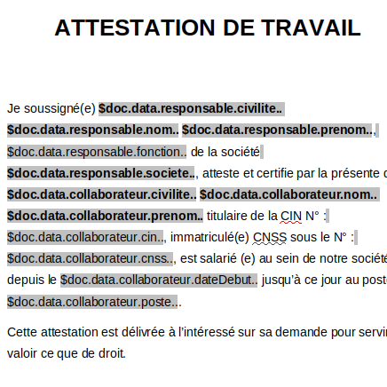
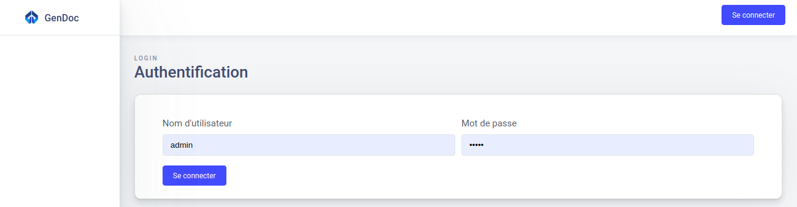
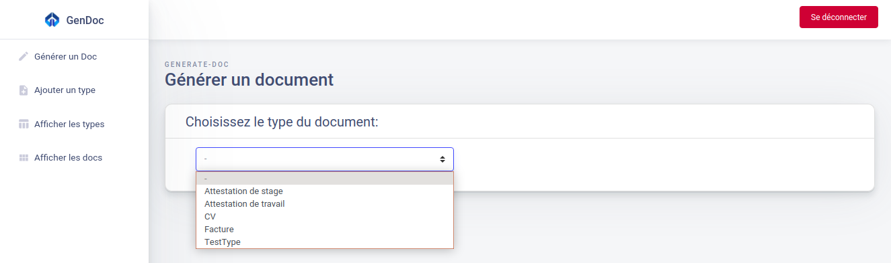
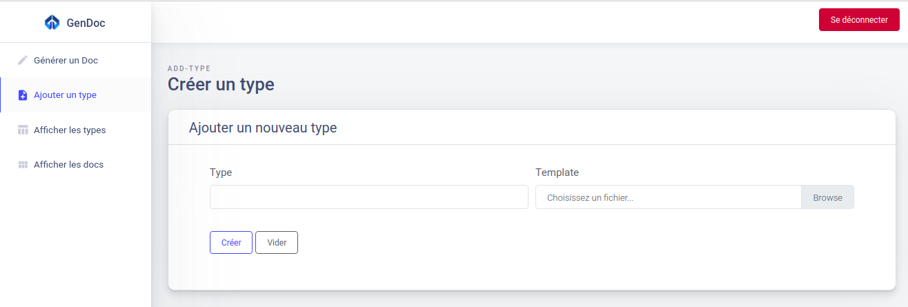

# GenDoc

## Présentation

GenDoc est un Micro Service pour la génération des documents interne utilisés au sein de Novelis :
* Attestation de stage, attestation de travail
* Les CVs des collaborateurs
* Les factures pour des clients
* et d'autres documents personnalisés fournies par l'utilisateur

## Technologies

* Java8/JEE, XDocReport, Jackson
* Spring boot, JHipster JDL, Swagger
* Reactjs, ES6, axios, boostrap4


## Tâches à faire

- [X] Conception du projet (documentation, uml..)
- [X] Création du Micro Service (jhipster, jdl...)
- [X] Création des templates (cv, attestations...)
- [X] Création des services de génération (rest/json, xdocreport)
- [X] Création d’un service générique (json + docx)
- [X] Création de l'interface utilisateur (reactjs)
- [ ] Intégration du Micro Service avec Novy

## Liens

```bash
# GenDoc Microservice
https://github.com/ilyasslazaar/genDoc
# GenDoc Frontend
https://github.com/ilyasslazaar/genDoc-front
```

## Tester

### GenDoc microservice

GenDoc a été développé en utilisant JHipster, vous avez besoin de lancer le Gateway , Registry dans la même machine/serveur pour pouvoir l'utiliser.

- Cloner ou télécharger le code source du Micro Service, puis dans un terminale, lancez :

```bash
cd /gendoc
 ./mvnw
```

- Vous pouvez accéder à GenDoc en visitant l'adresse suivante :

```bash
# GenDoc
127.0.0.1:8081

# De la même façon, créez et lancez Gateway et Registry
# Registry
127.0.0.1:8761

# Gateway
127.0.0.1:8080
```

- Pour explorer les méthodes REST :

```bash
# Rentrer au Gateway suivant cette adresse
127.0.0.1:8080

# Connecter vous (admin:admin)
127.0.0.1:8080/admin/docs

# Dans Swagger, Choisissez 'gendoc' comme service, vous aurez :
- les méthodes REST du model 'Doc'
- les méthodes REST du model 'Type'
```

### GenDoc UI

Pour explorer l'interface utilisateur de GenDoc (reactjs) :

- Cloner ou télécharger le code source de l'interface depuis :

```bash
https://github.com/ilyasslazaar/genDoc-front
```
- Dans un terminale, installer les composants requis pour le fonctionnement de l'app Reactjs :

=======

### GenDoc microservice

#### Présentation

GenDoc a été développé en utilisant JHipster, donc vous avez besoin de lancer un Gateway et un Registry dans la même machine/serveur pour pouvoir l'exploiter.

- Cloner ou télécharger le code source du Micro Service, puis dans un terminale, lancez :

```bash
cd /gendoc
sudo ./mvnw
```

- Vous pouvez accéder à GenDoc en visitant l'adresse suivante :

```bash
# GenDoc
127.0.0.1:8081

# De la même façon, créez et lancez Gateway et Registry
# Registry
127.0.0.1:8761

# Gateway
127.0.0.1:8080
```

- Pour explorer les méthodes REST :

```bash
# Rentrer au Gateway suivant cette adresse
127.0.0.1:8080

# Connecter vous (admin:admin)
127.0.0.1:8080/admin/docs

# Dans Swagger, Choisissez 'gendoc' comme service, vous aurez :
- les méthodes REST du model 'Doc'
- les méthodes REST du model 'Type'
```
#### Exemples

- Pour générer un document en utilisant une requette HTTP, envoyez une requette POST :
```bash
url: http://127.0.0.1:8081/api/docs/generate
auth: #fournit par serveur
request:
    data: 
{
    "signed": true,
    "typeName": "Attestation de travail",
    "data": {
    "lieuLivraison": "Oujda",
    "dateLivraison": "25 Mai 2020",
    "responsable": {
      "civilite": "Monsieur",
      "nom": "Tom",
      "prenom": "Cat",
      "fonction": "Directeur",
      "societe": "SOCIETE X"
    },
    "collaborateur": {
      "civilite": "Monsieur",
      "nom": "Jeery",
      "prenom": "Terry",
      "cin": "F92929",
      "cnss": "2299002991",
      "poste": "Ingénieur d'étude et développement",
      "dateDebut": "Avril 2017"
    }
    }
}
```

- Pour créer une nouvelle template d'un type de document :

```bash
# Suivez ce tutoriel officiel pour pouvoir créer une template docx
https://github.com/opensagres/xdocreport/wiki/Overview

# Pour les tags de velocity qui seront remplacé par les données fournit en JSON
# de façon que les sous-données de `data` dans JSON, seront utilisées de cette façon
# par exemple :
$doc.data.responsable.prenom
# Cette expression retourne "Cat" après la génération du document
```

- Exemple de template 'docx' :



- Pour ajouter une nouvelle signature :

```bash
# Modifier l'image `signature.jpg` dans GenDoc
cd /gendoc/src/main/resources/velocity-templates/signature.jpg
```

### GenDoc UI

#### Présentation

Pour explorer l'interface utilisateur de GenDoc (reactjs) :

- Cloner ou télécharger le code source de l'interface depuis :

```bash
https://github.com/ilyasslazaar/genDoc-front
```
- Dans un terminale, installer les composants requis pour le fonctionnement de l'app Reactjs :

```bash
cd /genDoc-front

# Installer les composants node
sudo npm install

# Lancer le serveur node
sudo npm start
```
- Pour accéder à l'interface utilisateur (L'interface ne fonctionne que si vous lancer GenDoc + Gateway + Registry en parallèle) :

```bash
# Dans un navigateur, tapez
127.0.0.1:3000

# Connecter vous (admin:admin) // pour l'information, l'IU utilise les même authentifiants que le Gateway JHipster
127.0.0.1:3000/login

# Vous allez être rediriger vers l'acceuil

# Pour générer un document // choisissez le type du document que vous voulez générer
127.0.0.1:3000/generate-doc

# Pour ajouter un nouveau type // entrer le nom du type, et monter la template 'docx'
127.0.0.1:3000/add-type

# Pour afficher les types de documents existants
127.0.0.1:3000/show-types

# Pour afficher les documents généré
127.0.0.1:3000/show-docs
```


=======
#### Exemples





